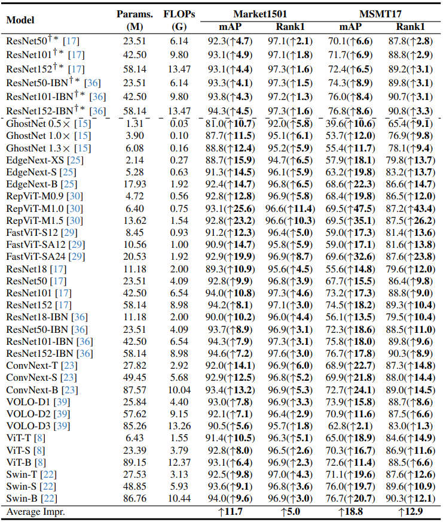

# CION_ReIDZoo
<div align="center"></div>

**ReIDZoo** is a new fully open-sourced **pre-trained model zoo** to meet diverse research and application needs in the field of person re-identification. It contains a series of CION pre-trained models with spanning structures and parameters, totaling 32 models with 10 different structures, including GhostNet, ConvNext, RepViT, FastViT and so on. 

**CION** is our proposed person re-identification **pre-training framework** that deeply utilizes cross-video identity correlations. It simply consists of a progressive identity correlation seeking strategy and an identity-guided self-distillation pre-training technology.

**CION-AL** is a new large-scale person re-identification **pre-training dataset** with almost accurate identity labels. The images are obtained from LUPerson-NL based on our proposed progressive identity correlation seeking strategy. It contains 3,898,086 images of 246,904 identities totally.

Our pre-trained models enable existing person ReID algorithms to achieve significantly better performance without bells and whistles. In this project, we will open-source all the code, models and dataset. More details can be found at our paper [Cross-video Identity Correlating for Person Re-identification Pre-training](https://neurips.cc/virtual/2024/poster/95254).


## News

* 🙂[2024.9.26] Good News! Our paper is accepted by **NeurIPS2024**.

## ReIDZoo
**ReIDZoo contains 32 CION pre-trained models with 10 different structures**. Among them, the **GhostNet, EdgeNext, RepViT and FastViT** are representative models with lightweight designs, which have smaller computational overhead and are convenient for practical deployment. Meanwhile, the **ResNet, ResNet-IBN, ConvNext, VOLO, Vision Transformer and Swin Transformer** are conventional models, which usually have more parameters and enjoy better performance. 

The supervised fine-tuning performance of each model is shown in the table below. The up-arrow value represents the performance improvement compared to each corresponding ImageNet pre-trained model. As a common practice, we utilized MGN and TransReID as the fine-tuning algorithms. Please refer to [our paper](https://neurips.cc/virtual/2024/poster/95254) for more experimental details and results. 

<div align="center"></div>


## CION

CION is our proposed **C**ross-video **I**dentity-c**O**rrelating pre-trai**N**ing framework for person re-identification. By utilizing our CION to pre-train the models, it is easier to learn identity-invariant representations for person re-identification. 

Now, we introduce the guidelines of how to pre-train the models from scratch, and how to fine-tune the pre-trained models based on TransReID, MGN (supervised ReID) and C-Contrast (unsupervised ReID).

### Dataset Prepare

Download the CION-AL dataset and organize it in `dataset` folder as follows:

```
|-- CION_Pretrain/
|   |-- dataset/
|   |   |-- CION_AL/
|   |       |-- sec0
|   |       |-- sec1
|   |       |-- ...
|   |       |-- sec129
|   |       |-- cional_annos.json
|   |-- data/
|   |-- models/
|   |-- loss.py
|   |-- run.py
|   |-- utils.py
```

### Pre-train from Scratch

As a default setting, we use 8×V100 (32GB) GPUs for pre-training the models. We set different batch sizes and numbers of local cropped views for different model to achieve better computational resouce utilization. Specific settings for each model can be found in Table 5 of [our paper](https://neurips.cc/virtual/2024/poster/95254). 

Taking ResNet50-IBN as an example, run the following command to implement the pre-training process. On 8 V100s, the entire pre-training process will take approximately 5 days.

```
CUDA_VISIBLE_DEVICES=0,1,2,3,4,5,6,7 python -m torch.distributed.launch --nproc_per_node=8 run.py --arch resnet50_ibn --batch_size_per_gpu 120 --local_crops_number 8 --output_dir logs/resnet50_ibn
```

## TBD
Please stay tuned for future updates.
