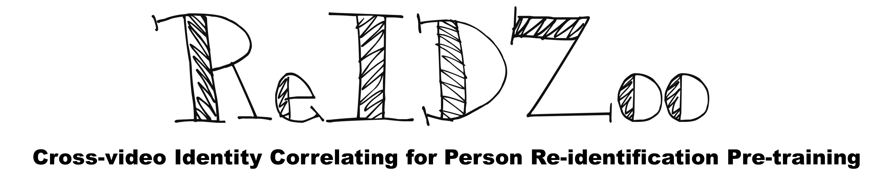

# CION_ReIDZoo

**ReIDZoo** is a new fully open-sourced **pre-trained model zoo** to meet diverse research and application needs in the field of person re-identification. It contains a series of CION pre-trained models with spanning structures and parameters, totaling 32 models with 10 different structures, including GhostNet, ConvNext, RepViT, FastViT and so on. 

**CION** is our proposed person re-identification **pre-training framework** that deeply utilizes cross-video identity correlations. It simply consists of a progressive identity correlation seeking strategy and an identity-guided self-distillation pre-training technology.

**CION-AL** is a new large-scale person re-identification **pre-training dataset** with almost accurate identity labels. The images are obtained from LUPerson-NL based on our proposed progressive identity correlation seeking strategy. It contains 3,898,086 images of 246,904 identities totally.

Our pre-trained models enable existing person ReID algorithms to achieve significantly better performance without bells and whistles. In this project, we will open-source all the code, models and dataset. More details can be found at our paper [Cross-Video Identity Correlating for Person Re-identification Pre-training](https://neurips.cc/virtual/2024/poster/95254).

## News

* 🙂[2024.9.26] Good News! Our paper is accepted by **NeurIPS2024**.

## ReIDZoo
**ReIDZoo contains 32 CION pre-trained models with 10 different structures**. Among them, the **GhostNet, EdgeNext, RepViT and FastViT** are representative models with lightweight designs, which have smaller computational overhead and are convenient for practical deployment. Meanwhile, the **ResNet, ResNet-IBN, ConvNext, VOLO, Vision Transformer and Swin Transformer** are conventional models, which usually have more parameters and enjoy better performance. 

The fine-tuning performance of each model is shown in the table below. The up-arrow value represents the performance improvement compared to each corresponding ImageNet pre-trained model. As a common practice, we utilized MGN and TransReID as the fine-tuning algorithms. Please refer to our paper for more experimental details and results. 

## TBD
Please stay tuned for future updates.
